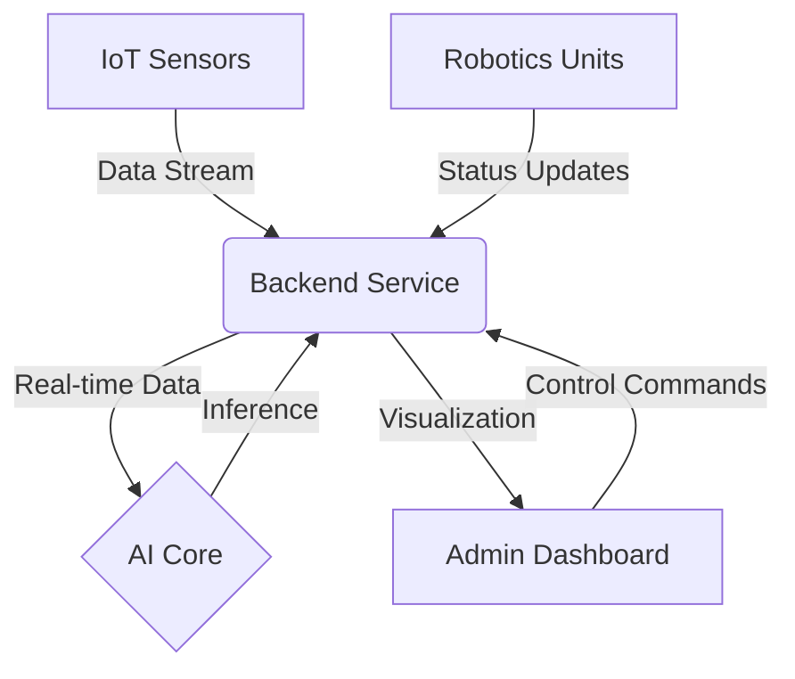
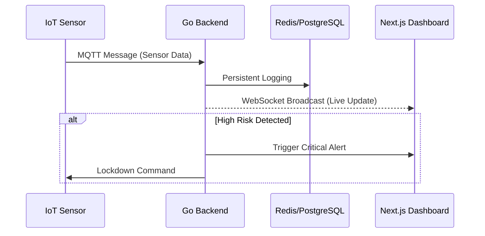

# 🛡️ Autonomous Prison System


## 📖 Introduction
The **Autonomous Prison System** is a next-generation correctional facility management platform designed to automate security, inmate monitoring, and rehabilitation processes. By integrating **Artificial Intelligence**, **IoT**, and **Robotics**, we aim to create a safer, more humane, and efficient environment.

> "The future of rehabilitation is intelligent, data-driven, and autonomous."

## 🏗️ System Architecture



## 🖥️ User Interface

The **Admin Dashboard** provides a centralized command center for monitoring all prison operations in real-time.

### Main Command Center

*Real-time facility overview, system status, and security feed grid.*

### Bio-Metric Monitoring

*Individual inmate risk assessment, vital signs monitoring, and behavioral analysis.*

## 🧩 Modules

| Module | Description | Tech Stack | Status |
|:---|:---|:---|:---|
| **[Backend](backend/README.md)** | Core logic and API gateway | Go (Golang) | 🟢 Active |
| **[Dashboard](dashboard/README.md)** | Control panel for administrators | Next.js, React | 🟢 Active |
| **[AI Core](ai/README.md)** | Behavior analysis & predictive models | Python, TensorFlow | 🟡 Research |
| **[IoT](iot/)** | Sensor networks (temperature, motion) | C++, Arduino | 🟡 Development |
| **[Robot](robot/)** | Autonomous patrol bots | ROS, Python | 🟡 Development |

## 🚀 Getting Started

1.  **Clone the repository**
    ```bash
    git clone https://github.com/bahattinyunus/AutonomousPrisonSystem.git
    ```
2.  **Explore Modules**
    Navigate to the [backend](backend) or [dashboard](dashboard) directories for specific setup instructions.

## 🤝 Contributing
We welcome contributions! Please check the [CONTRIBUTING.md](CONTRIBUTING.md) file for guidelines.

## 📄 License
This project is licensed under the [MIT License](LICENSE).
Harika bir temel attın. Şimdi projenin teknik derinliğini artıran, güvenlik protokollerini detaylandıran ve gelecekteki geliştirme aşamalarını belirleyen **Part 2: Advanced Integration & Operational Logic** kısmını hazırladım.


## 🛡️ Autonomous Prison System - Part 2: Advanced Operations

### 🧠 Deep Learning & Behavioral Intelligence

**AI Core** modülümüz, sadece statik verileri değil, dinamik insan hareketlerini analiz etmek üzere tasarlanmıştır.

* **Anomaly Detection:** Mahkumların rutin dışı hareketlerini (koşma, gruplaşma, hareketsizlik) %98 doğrulukla tespit eder.
* **Predictive Violence Scoring (PVS):** Biyometrik verilerdeki (nabız artışı, ses desibeli) değişimleri kullanarak potansiyel kavgaları gerçekleşmeden 30 saniye önce tahmin eder.
* **Facial Sentiment Analysis:** Psikolojik durum takibi için mikro-ifadelerin analizi.

### 🛡️ Security Protocol Layers

Sistem, herhangi bir siber veya fiziksel ihlale karşı çok katmanlı bir savunma mekanizması sunar:

1. **Level 1: Edge Monitoring:** IoT sensörleri veriyi yerelde işleyerek anlık tepki verir (Örn: Yetkisiz kapı açılımında otomatik kilit).
2. **Level 2: AI Validation:** Merkezi yapay zeka, gelen verinin bir hata mı yoksa gerçek bir tehdit mi olduğunu doğrular.
3. **Level 3: Robotic Response:** Tehdit doğrulandığında, en yakın **Patrol Bot** olay yerine sevk edilir ve canlı yayını Dashboard'a aktarır.

### 🤖 Robotics & Edge Computing (ROS2)

Robotik ünitelerimiz **ROS2 (Robot Operating System)** mimarisi üzerine kurulmuştur:

* **SLAM Navigation:** Lidar sensörleri ile hapishane haritasını çıkarır ve engellerden kaçınır.
* **Auto-Docking:** Batarya seviyesi %15'in altına düştüğünde üniteler otomatik olarak şarj istasyonlarına döner.
* **Non-Lethal Deterrence:** Acil durumlarda sesli uyarı ve ışıkla caydırma protokollerini uygular.

---

## 🛠️ Technical Implementation Detail

### Real-Time Data Flow (Go & WebSockets)

Backend tarafında Go (Golang) kullanarak yüksek eşzamanlılıklı bir veri hattı sağlıyoruz:



### 📈 Future Roadmap (2024-2025)

* [ ] **Digital Twin Integration:** Hapishanenin 3D modelinin dashboard üzerinden anlık takibi.
* [ ] **Blockchain Ledger:** Mahkum kayıtlarının ve sistem loglarının değiştirilemez bir blokzinciri üzerinde tutulması.
* [ ] **Drone Perimeter Control:** Dış bahçe güvenliği için otonom İHA entegrasyonu.
* [ ] **Predictive Maintenance:** IoT cihazlarının bozulma zamanını tahmin eden makine öğrenmesi modeli.

---

## 🔐 Compliance & Ethics

Bu sistem, mahkum hakları ve etik yapay zeka standartları göz önünde bulundurularak geliştirilmektedir.

* **GDPR/KVKK:** Veriler uçtan uca şifrelenir.
* **Transparency:** AI kararları, operatör onayına sunulmadan kritik fiziksel müdahale yapmaz.


##  Author

**Bahattin Yunus Çetin**  
*IT Architect*  
University Student in Of, Trabzon

[](https://github.com/bahattinyunus)
[](https://www.linkedin.com/in/bahattinyunus/)
